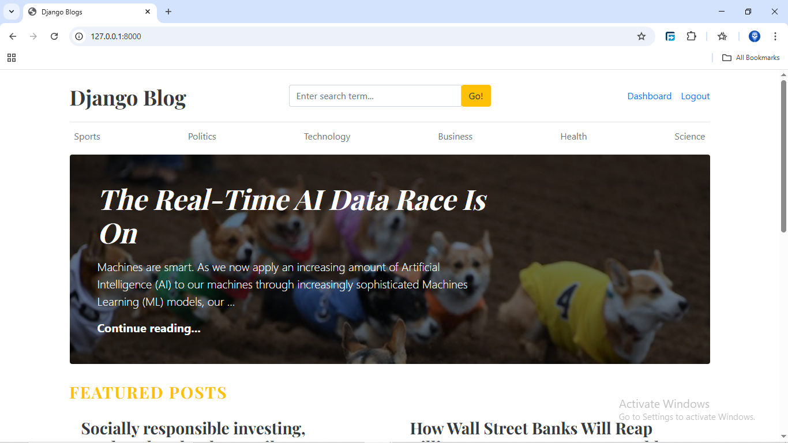
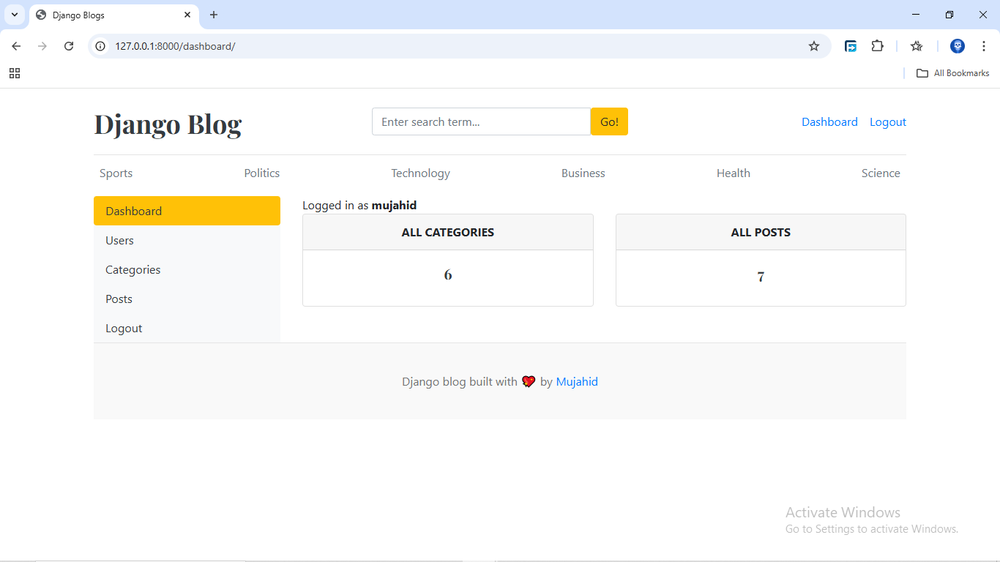

# Django Blog Project

**Django Blog Website** adalah aplikasi web yang dibangun menggunakan framework Django untuk mengelola dan menampilkan artikel secara dinamis. Aplikasi ini memungkinkan pengguna untuk melihat daftar artikel terbaru, membaca artikel lengkap, serta memungkinkan admin untuk mengelola konten melalui panel admin Django. Dengan menggunakan teknologi seperti Python, Django, dan SQLite, proyek ini dirancang untuk memperdalam pemahaman tentang pengembangan backend menggunakan Django dan pengelolaan data berbasis web.

## Features

- Daftar Artikel
- Halaman Detail Artikel
- Manajemen Artikel
- Tampilan Responsif
- Panel Admin Django

## Tech Stack

Python, Django, HTML, CSS, SQLite

## Screenshots

